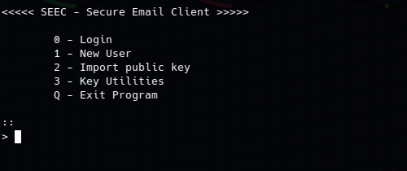
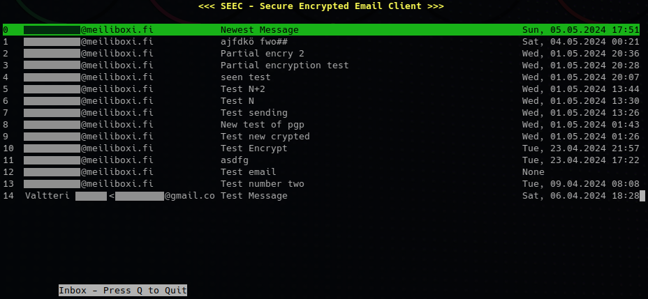
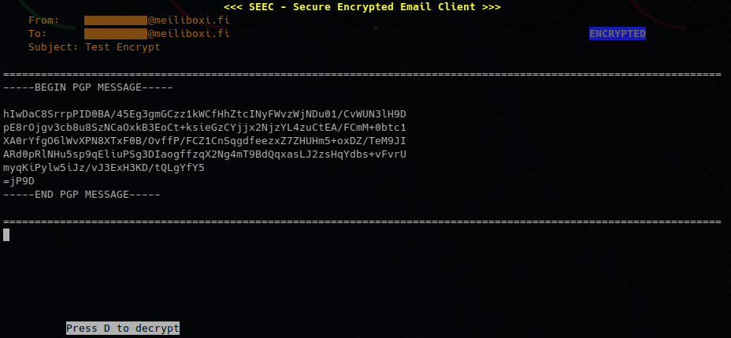
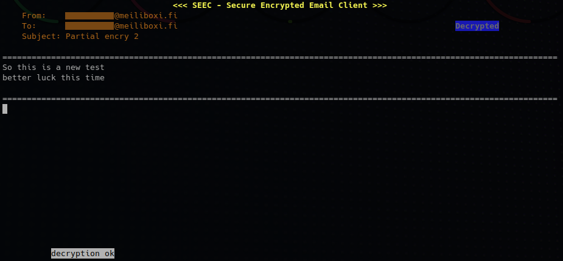
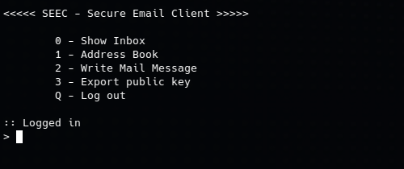
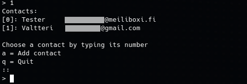

# SEEC

A command line email client using PGP for end-to-end encryption.
Created as a course project submission for Tampere University **Secure Programming** [(COMP.SEC.300-2023-2024-1-TAU)](https://moodle.tuni.fi/course/view.php?id=40916 "COMP.SEC.300-2023-2024-1 Secure Programming (Lectures and exercises)") course.

- [**AI use Disclosure**](docs/ai_use_disclosure.md)

#### Disclaimer!

This software is made as an exercise and comes with NO WARRANTY WHAT SO EVER. Though I've made every effort to follow OWASP secure programming practices, the software has not been audited by a professional entity. The real world security has not been verified. The client is incredibly bare-bones. It is more like an example project or proof-of-concept, than a practical client for day-to-day emails.

## Index

- [What is SEEC](#what-is-seec)
	- [Technical documentation](#technical-documentation)
	- [Features](#features)
		- [Security Features](#security-features)
		- [Technical details](#technical-details)
		- [Known issues](#known-issues)
	- [Encryption](#encryption)
		- [Security info](#security-info)
		- [Warning!](#warning)
- [Usage](#usage)
	- [Setting up](#setting-up)
		- [1. Download the SEEC project or clone from GitHub](#1-download-the-seec-project-or-clone-from-github)
		- [2. Requirements](#2-requirements)
		- [3. Configure config.yml](#3-configure-configyml)
		- [Note about email providers support for standard email clients](#note-about-email-providers-support-for-standard-email-clients)
	- [Running the first time](#running-the-first-time)
		- [4. Run `main.py`](#run-mainpy)
		- [5. Run Setup Wizzard for Encryption (optional, but highly recommended)](#5-run-setup-wizzard-for-encryption-optional-but-highly-recommended)
			- [Using without encryption (not recommended)](#using-without-encryption-not-recommended)
		- [5b. Import old Private Key and Config (Advanced)](#5b-import-old-private-key-and-config-advanced)
		- [6. Import public keys](#6-import-public-keys)
	- [Loggin in](#loggin-in)
	- [Inbox](#inbox)
	- [Read message](#read-message)
	- [Sending messages](#sending-messages)
	- [Address book](#address-book)
	- [Key management](#key-management)
		- [Adding public keys](#adding-public-keys)
		- [Exporting your public key](#exporting-your-public-key)
		- [More advanced stuff](#more-advanced-stuff)
- [Troubleshooting](#troubleshooting)

## What is SEEC

**Secure Encrypted Email Client (SEEC) is a light weight, cross platform, CLI email client providing integration with *GNU Privacy Guard*, to offer industry standard *OpenPGP* encryption for all\*¹ messages.**

Typically with all email clients, all messages to-and-from email servers, are SSL/TLS encrypted, but the email provider may be able to read the contents of messages, while on their servers. PGP offers a robust way to implement end-to-end encryption in emails, solving the biggest security issue with emails.

Using PGP is not very easy or convenient. Few email clients offer plugins, much less in built support for PGP. SEEC aims to solve*² this.

To achieve the maximum of platform independence, SEEC is written in Python 3.7, and runs on the command line. It can be installed on at least
- Windows (x86)
- Desktop Linux (x86)
- Linux (ARM)

In theory it might work on Android devices, with a terminal emulator, but I haven't tested this.

##### *Disclaimers*

1) \**Recipients public key needs to be imported, to be able to encrypt messages. SEEC makes importing easy*
2) \**SEEC is not a fully featured email client. More like a proof of concept.*

#### Technical documentation

- [Roadmap](docs/roadmap.md)
- [Security analysis](docs/security_analysis.md) based on [OWASP Secure Coding Practices Checklist](https://owasp.org/www-project-secure-coding-practices-quick-reference-guide/stable-en/02-checklist/05-checklist)
- [Reasoning for Security Choises](docs/notes_on_security.md)
- [AI use Disclosure](docs/ai_use_disclosure.md)

### Features

#### Security Features

- Asymmetric encryption for messages (PGP)
	- RSA 2048-bit
- Config containing email credentials is encrypted
	- AES-128 CBC
- Private key is encrypted by default
- Using encryption is the default
- User is warned before sending unecrypted messages
- Client will not load dynamic content (text only).
	- This protects from tracking methods
	- Prevents malicious code from excecuting
- Enforces SSL/TLS for communicating with email servers.
- Input validation
- Secure error handling
	- Logs out and clears session and login info in case of an unknown exception

See more in [Technical documentation](#technical-documentation)

#### Technical details

- Minimum supported character display size: 10 x 60

#### Known issues

1. All messages in inbox are marked as 'read', when inbox is viewed
2. Lacking more advanced optimizations, the maximum supported number of messages in inbox is 100 000. Older messages are not loaded.
3. Resizeing window while running is not supported
4. Sending messages to multiple recipients is not explicitly supported, due to each recipient needing a different key for encryption. Technically plaintext messages are possible to send to multiple recipients, by typing in each recipients address manually.

### Encryption

For encrypting messages, SEEC uses the [standard asymmetric encryption used by OpenPGP](https://www.gnupg.org/faq/gnupg-faq.html#default_rsa2048), 2048-bit RSA. It ensures compatibility with other PGP clients. One day elliptic curve cryptography will become the standard, but it unfortunately, at the time of writing is not.

For encrypting the configuration file, containing the email server credentials, SEEC uses Python [Fernet](https://cryptography.io/en/latest/fernet/) library, which uses AES-128 in CBC mode.[^1]

#### Security info

Your passphrase you enter will be used to unlock the email client and the private PGP key.

This program interfaces with an external GPG program to handle PGP encryption. It may be configured by default to remember your passphrase for a few minutes, even if you logged out of SEEC. You can change this in GPG settings.

By default, SEEC does not save any of your messages to disk. This is to protect your privacy.

[^1]: https://github.com/pyca/cryptography/blob/main/src/cryptography/fernet.py

#### Warning!

Email header info is not encrypted. Do not put sensitive information in the subject field.

## Usage

### Setting up

#### 1. **Download the SEEC project or clone from GitHub**

`https://github.com/JValtteri/seec-email.git`

#### 2. **Requirements**

 Requirements | version
  ---- | :--:
Python | >= 3.7
pyyaml | >= 5.4
python-gnupg | >= 0.5.2
cryptography | >= 40.0.1
windows-curses<br>(on Windows) | >=2.3.2

#### **Install requirements**

```
pip install -r requirements.txt
```

This program relies on [**GnuPG (gpg)**](https://www.gnupg.org/download/index.html). It is pre-installed on most Linux systems. It is also available for Windows.

Additionally Windows users need Windows version of `curses`, called `windows-curses`. Install it with the command:

```
pip install windows-curses
```

#### 3. **Configure config.yml**

Fill out according to your email providers instructions
SEEC does not support insecure connections. SSL encryption for
both incoming and outgoing mail must be set to `true`.

```yaml
address: email@address.com
password: p4ssp0rd

# Incoming
map: imap.address.com
map_port: 993
map_security: true

# Outgoing
smtp: smtp.address.com
smtp_port: 587
smtp_security: true
```

#### Note about email providers support for standard email clients

Google has [discontinued support](https://support.google.com/mail/answer/7126229?hl=en) for the standard email authentication method, and instead requires the use of [OAuth 2.0 "Sign in with Google" API](https://developers.google.com/identity/protocols/oauth2). Since this is a not yet a ubiquitous way of authenticating  with email servers, it is outside the main scope of this project.

### Running the first time

#### 4. **Run `main.py`**

#### 5. **Run Setup Wizzard for Encryption (optional, but highly recommended)**

The config.yml you created in the previous steps will be imported and encrypted with your password. Select `1` from the menu. You will be guided through creating a new password, generating a new key pair and encrypting your config. You will be shown a series of instructions and warnings. Continue by pressing enter. You can abort at any time by pressing `Ctrl+C`.

**Warning!** if you lose your password, you will lose access to your configuration file and your private key, and lose access to all your encrypted messages.

##### Using without encryption (not recommended)

Though not recommended, SEEC can be used without encryption. If you don't run the Encryption Setup Wizzard, SEEC will use the plain text config file and no keys will be generated. Since there is basically no downside to creating the keys and encrypting your email credintials is good for security, **and is highly recommended**. You can still import public keys to encrypt your messages, you just won't be able to decrypt any.

#### 5b. Import old Private Key and Config (Advanced)

If you alredy have a key pair you want to use, you need to run the wizzard anyway. The set password must match the passphrase for ther private key. You can delete the extra keys you don't need afterward.

1. Encrypt your config (optional but highly recommended)
	- Run the wizzard and set the password same as you have for your old key.
2. Delete the created keys
	1. Run to the key utility `3` or `python key_utility.py`.
	2. List private keys `2s`
	3. Copy the key fingerprint
	4. Delete the private key `4s` (paste the fingerprint)
	5. Delete the public key key `4` (paste the fingerprint)
3. Import your old keys
	1. In Key utility select `1`, or in SEEC select `2` to import keys.
	2. Copy Paste both your private and public key in to the enry field. Make sure there are no more than one consecutive empty line between the keys.
	3. Finally, press enter a few times to confirm.

#### 6. Import public keys

To be able to send encrypted messages, you need the recipients' public keys. You can import them by selecting `2`. Copy paste the key data and press enter a few times.

If you import multiple keys at once, make sure there are no more than one consecutive empty line between them. SEEC interprits two or more empty lines to be end of input.

### Loggin in

After configuring the client, you can now log in from the menu, by selecting `0`.



You will be prompted for your password. Password will be stored for the duration of your session.

The client will
- load and decrypt the config in to memory
- log in to your email server with the credentials defined in the config.yml.

### Inbox

While logged in, chose `0` to view the inbox.

Use arrow keys and enter to select a message.



To go back, enter `Q`.

### Read message

The encryption status is displayed in the top right hand corner. For an encrypted message, pressing `D` will attempt to decrypt the message with your public key.





If the decrypt fails, the output is empty, and a corresponding status message is displayed at the bottom of the screen.

### Sending messages

There are two ways of sending a message.



- A) Opening the address book, by selecting `1` and selecting the recipient by typing it's number.
- B) Selecting `2` from the menu and manually entering the address.

If a public key is available for the address, you are prompted to encrypt the message.

### Address book



Address book allows you to send messages, and add new contacts. You can access it while logged in, by selecting `1`.

The contacts are stored as an unencrypted `contacts.yml` file.

### Key management

#### Adding public keys

- From main menu, select import key.
- Copy the key in to the entry field

The key is automatically associated with correct email addresses.

#### Exporting your public key

When logged in, press `3` to export your public key. The key will be printed on screen. You can copy it form there, and paste it to an email, or deliver it another way. Using it others will be able to encrypt messages to you, but only you can open the messages, using your private key.

#### More advanced stuff

A Key Utility is also provided to you. You can access it from the main menu by selecting `3`, or by running `core/crypto/key_utility.py` directly. It offers more direct access to cryptographic features of SEEC, and supports more actions than the email client itself. It is intended for testing and troubleshooting, but is not explicitly supported.

The keyring file is `seec.pkr`. It is stored in the `seec-email/core/crypto/` folder. You can access it directly with any OpenPGP compatible program. Assuming you have followed the install instructions, you should have `gpg` installed.

Your private key is secured with the password you created when creating your user in SEEC.

## Troubleshooting

#### The program crashes at startup

- Make sure all files are present. If necessary, pull missing files from GitHub.
- Check that **all** [requirements](#2-requirements) are met:
	- On Windows, make sure you have installed:
		- `windows-curses`
		- [GnuPG (gpg)](https://www.gnupg.org/download/index.html)
	- On Linux, make sure you have [GnuPG (gpg)](https://www.gnupg.org/download/index.html) installed

#### On decrypt, I get an empty message

Decryption has failed. Either the password was incorrect, or the message was encrypted with a wrong key.

#### Unable to generate new key

##### I deleted the old keyring and now key generation fails

- Reboot. After GPG agent restarts you should be able to create a new keyring.
- If the problem persists, delete remaining GPG related files. Be sure not to delete `gpg-agent.conf`.

##### I think I deleted `gpg-agent.conf`

- pull from repo to replace missing file(s)
- or copy manually from GitHub
- or create a new `gpg-agent.conf` with the following line in it: `allow-loopback-pinentry`

#### I lost my password

Nothing can be done.

There is no back door to give you access. Any such feature would be liable to be exploited. Use a password manager to securely store your passwords, so you don't loose them.
